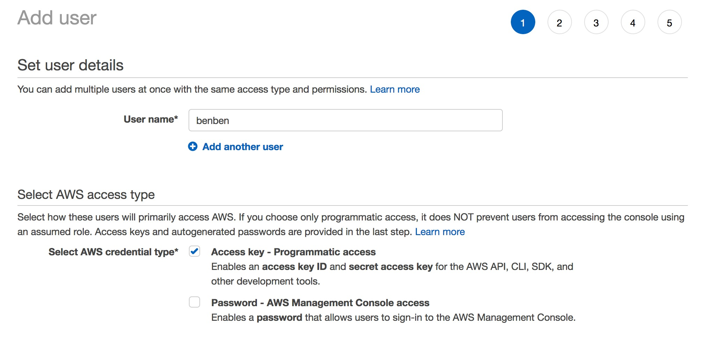
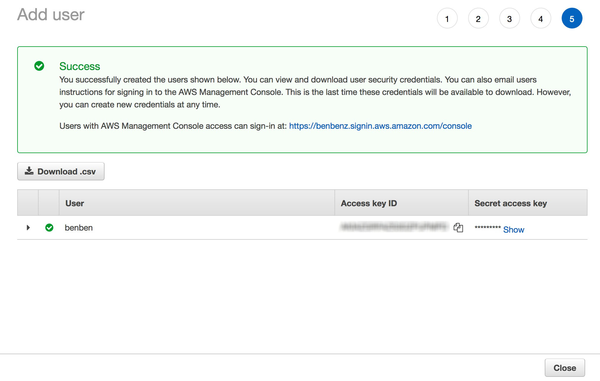

# Description

CloudRun is a Python package that allows you to run any script on a cloud service (for now AWS only).

# Features

- Easily run scripts on AWS by writing a simple configuration file
- Handles Python and Julia scripts, or any command
- Handles PyPi , Conda/Mamba, Apt-get and Julia environments
- Multithreaded instance support
- Handles disconnections from instances, including stopped or terminated instances
- Handles interruption of CloudRun, with state recovery
- Runs locally or on a remote instance, with 'watcher' functionality 

# Pre-requisites

In order to use the python AWS client (Boto3), you need to have an existing AWS account and to setup your computer for AWS.

## with AWS CLI

1. Go to [the AWS Signup page](https://portal.aws.amazon.com/billing/signup#/start/email) and create an account
2. Download [the AWS CLI](https://docs.aws.amazon.com/cli/latest/userguide/getting-started-install.html)
3. In the AWS web console, [create a user with administrator privilege](https://docs.aws.amazon.com/streams/latest/dev/setting-up.html)
4. In the AWS web console, under the AMI section, click on the new user and make sure you create an access key under the tab "Security Credentials". Make sure "Console Password" is Enabled as well
5. In ther Terminal, use the AWS CLI to setup your configuration:
```
aws configure
```
See [https://docs.aws.amazon.com/cli/latest/userguide/cli-configure-quickstart.html](here)

<!--
6. To run in `nano` mode, you also need to [add the following credentials to your user](https://docs.aws.amazon.com/AWSEC2/latest/UserGuide/iam-roles-for-amazon-ec2.html) (maybe):
- iam:PassRole
- ec2:AssociateIamInstanceProfile
- ec2:ReplaceIamInstanceProfileAssociation
-->

## manually

1. Go to [the AWS Signup page](https://portal.aws.amazon.com/billing/signup#/start/email) and create an account
2. In the AWS web console, [create a user with administrator privilege](https://docs.aws.amazon.com/streams/latest/dev/setting-up.html)
3. In the AWS web console, under the IAM section, click on the new user and make sure you create an access key under the tab "Security Credentials". Make sure "Console Password" is Enabled as well
4. Add your new user credentials manually, [in the credentials file](https://docs.aws.amazon.com/cli/latest/userguide/cli-configure-profiles.html)

##### '~/.aws/config' example

```
[default]
region = eu-west-3
output = json
```

##### '~/.aws/credentials' example

```
[default]
aws_access_key_id = YOUR_ACCESS_KEY_ID
aws_secret_access_key = YOUR_SECRET_ACCESS_KEY
```

# Setting up a separate user with least permissions 
#### (manually) 

1. In the AWS web console, in the IAM service, create a group 'cloudrun-users' with 'AmazonEC2FullAccess' permissions
2. In the AWS web console, in the IAM service, create a user USERNAME attached to the 'cloudrun-users' group:
### Step 1

### Step 2

### ... Step 5

COPY the Access Key info !

3. Add your new user profile manually, [in the credentials file](https://docs.aws.amazon.com/cli/latest/userguide/cli-configure-profiles.html)

##### '~/.aws/config' example

```
[default]
region = eu-west-3
output = json

[profile cloudrun_USERNAME]
region = eu-west-3
output = json
```

##### '~/.aws/credentials' example

```
[default]
aws_access_key_id = YOUR_ACCESS_KEY_ID
aws_secret_access_key = YOUR_SECRET_ACCESS_KEY

[cloudrun_USERNAME]
aws_access_key_id = YOU_PROFILE_ACCESS_KEY_ID
aws_secret_access_key = YOUR_PROFILE_SECRET_ACCESS_KEY
```

4. add the 'profile' : 'cloudrun_USERNAME' to the configuration

```python
config = {

    ################################################################################
    # GLOBALS
    ################################################################################

    'project'      : 'test' ,                             # this will be concatenated with the instance hashes (if not None) 
    'profile'      : 'cloudrun_USERNAME' ,
    ...
```


# Installation

```bash
python3 -m venv .venv
source ./.venv/bin/activate
python -m pip install -r requirements.txt

# OR

curl -sSL https://install.python-poetry.org | python3.8 -
poetry install
```

# Usage / Test runs

```bash
# copy the example file
cp example/config.example.py config.py
#
# EDIT THE FILE
#

# to run
python3 -m cloudrun.demo 
# OR
poetry run demo
```

# Configuration example

```python
config = {

    ################################################################################
    # GLOBALS
    ################################################################################

    'project'      : 'test' ,                             # this will be concatenated with the instance hashes (if not None) 
    'profile'      : None ,                               # if you want to use a specific profile (user/region), specify its name here
    'dev'          : False ,                              # When True, this will ensure the same instance and dev environement are being used (while working on building up the project) 
    'debug'        : 1 ,                                  # debug level (0...3)
    'maestro'      : 'local' ,                            # where the 'maestro' resides: local' | 'remote' (micro instance)
    'provider'     : 'aws' ,                              # the provider name ('aws' | 'azure' | ...)
    'job_assign'   : None ,                               # algorithm used for job assignation / task scheduling ('random' | 'multi_knapsack')
    'recover'      : True ,                               # if True, CloudRun will always save the state and try to recover this state on the next execution
    'print_deploy' : False ,                              # if True, this will cause the deploy stage to print more (and lock)
    'mutualize_uploads' : True ,                          # adjusts the directory structure of the uploads ... (False = per job or True = global/mutualized)


    ################################################################################
    # INSTANCES / HARDWARE
    ################################################################################

    'instances' : [
        { 
            'region'       : None ,                       # can be None or has to be valid. Overrides AWS user region configuration.
            'cloud_id'     : None ,                       # can be None, or even wrong/non-existing - then the default one is used
            'img_id'       : 'ami-077fd75cd229c811b' ,    # OS image: has to be valid and available for the profile (user/region)
            'img_username' : 'ubuntu' ,                   # the SSH user for the image
            'type'         : 't2.micro' ,                 # proprietary size spec (has to be valid)
            'cpus'         : None ,                       # number of CPU cores
            'gpu'          : None ,                       # the proprietary type of the GPU 
            'disk_size'    : None ,                       # the disk size of this instance type (in GB)
            'disk_type'    : None ,                       # the proprietary disk type of this instance type: 'standard', 'io1', 'io2', 'st1', etc
            'eco'          : True ,                       # eco == True >> SPOT e.g.
            'eco_life'     : None ,                       # lifecycle of the machine in ECO mode (datetime.timedelta object) (can be None with eco = True)
            'max_bid'      : None ,                       # max bid ($/hour) (can be None with eco = True)
            'number'       : 1 ,                          # multiplicity: the number of instance(s) to create
            'explode'      : True                         # multiplicity: can this instance type be distributed accross multiple instances, to split CPUs
        }

    ] ,

    ################################################################################
    # ENVIRONMENTS / SOFTWARE
    ################################################################################

    'environments' : [
        {
            'name'         : None ,                       # name of the environment - should be unique if not 'None'. 'None' only when len(environments)==1

            # env_conda + env_pypi  : mamba is used to setup the env (pip dependencies included)
            # env_conda (only)      : mamba is used to setup the env
            # env_pypi  (only)      : venv + pip is used to setup the env 

            'command'      : 'example/install_julia.sh' ,      # None, or a string: path to a bash file to execute when deploying
            'env_aptget'   : [ "openssh-client"] ,        # None, an array of librarires/binaries for apt-get
            'env_conda'    : "example/environment.yml",   # None, an array of libraries, a path to environment.yml  file, or a path to the root of a conda environment
            'env_pypi'     : "example/requirements.txt" , # None, an array of libraries, a path to requirements.txt file, or a path to the root of a venv environment 
            'env_julia'    : [ "Wavelets" ] ,             # None, a string or an array of Julia packages to install (requires julia)
        }
    ] ,

    ################################################################################
    # JOBS / SCRIPTS
    ################################################################################

    'jobs' : [
        {
            'env_name'     : None ,                       # the environment to use (can be 'None' if solely one environment is provided above)
            'cpus_req'     : None ,                       # the CPU(s) requirements for the process (can be None)
            'run_script'   : 'example/run_remote.py 1 10',# the script to run (Python (.py) or Julia (.jl) for now) (prioritised vs 'run_command')
            'run_command'  : None ,                       # the command to run
            'upload_files' : [ "uploaded.txt"] ,          # any file to upload (array or string) - will be put in the same directory
            'input_file'   : 'input.dat' ,                # the input file name (used by the script)
            'output_file'  : 'output.dat' ,               # the output file name (used by the script)
            'repeat'       : 2 ,                          # the number of times this job is repeated
        } ,
        {
            'env_name'     : None ,                       # the environment to use (can be 'None' if solely one environment is provided above)
            'cpus_req'     : None ,                       # the CPU(s) requirements for the process (can be None)
            'run_script'   : 'example/run_remote.py 2 12',# the script to run (Python (.py) or Julia (.jl) for now) (prioritised vs 'run_command')
            'run_command'  : None ,                       # the command to run
            'upload_files' : [ "uploaded.txt"] ,          # any file to upload (array or string) - will be put in the same directory
            'input_file'   : 'input.dat' ,                # the input file name (used by the script)
            'output_file'  : 'output.dat' ,               # the output file name (used by the script)
        }
    ]
}
```

# Python API

```python
class CloudRunProcessState(IntFlag):
    UNKNOWN   = 0
    WAIT      = 1  # waiting for bootstraping
    QUEUE     = 2  # queued (for sequential scripts)
    IDLE      = 4  # script about to start
    RUNNING   = 8  # script running
    DONE      = 16 # script has completed
    ABORTED   = 32 # script has been aborted
    ANY       = 32 + 16 + 8 + 4 + 2 + 1 

class CLoudRunLightProvider(ABC):
class CloudRunFatProvider(ABC):

    def debug(self,level,*args,**kwargs):

    # start the provider: creates the instances
    # if reset = True, CloudRun forces a process cleanup as well as more re-uploads
    def start(self,reset):

    # assign jobs to instances
    def assign(self):

    # deploy all materials (environments, files, scripts etc.)
    def deploy(self):

    # run the jobs
    def run(self,wait=False):

    # run one job
    def run_job(self,job,wait=False):

    # watch the processes (= wait + revive instances when terminated)
    # with daemon (=True), the call is non blocking
    # without daemon (=False), the call is blocking and will display the processes/states
    def watch(self,processes=None,daemon=False):

    # wait for the processes to reach a state
    def wait_for_jobs_state(self,job_state,processes=None):

    # get the states of the processes
    def get_jobs_states(self,processes=None):

    # wakeup = start + assign + deploy + run + watch
    def wakeup(self)

    @abstractmethod
    def get_user_region(self,profile_name):

    @abstractmethod
    def get_recommended_cpus(self,inst_cfg):

    @abstractmethod
    def create_instance_objects(self,config,for_maestro):

    @abstractmethod
    def find_instance(self,config):

    @abstractmethod
    def start_instance(self,instance):

    @abstractmethod
    def stop_instance(self,instance):

    @abstractmethod
    def terminate_instance(self,instance):

    @abstractmethod
    def update_instance_info(self,instance):    

class CloudRunInstance():

    def get_region(self):

    def get_id(self):
     
    def get_name(self):

    def get_rank(self):

    def get_ip_addr(self):

    def get_dns_addr(self):

    def get_ip_addr_priv(self):

    def get_dns_addr_priv(self):

    def get_cpus(self):

    def get_state(self):

    def set_ip_addr(self,value):

    def set_dns_addr(self,value):
     
    def set_ip_addr_priv(self,value):

    def set_dns_addr_priv(self,value):

    def set_state(self,value):

    def set_invalid(self,value):

    def set_data(self,data):

    def get_data(self,key):
     
    def get_config(self,key):

    def append_job(self,job):

    def get_environments(self):

    def get_jobs(self):

    def get_config_DIRTY(self):

    def is_invalid(self):

    def update_from_instance(self,instance):

# GLOBAL methods 

def get_client(config):

def init_instance_name(instance_config):

def debug(level,*args,**kwargs):
```

Usually you may use the CloudRunProvider the following way:

```python

from cloudrun      import provider as cloudrun
from cloudrun.core import CloudRunProcessState
import asyncio 

# load config
config = __import__(config).config

# create provider: this loads the config
provider = cloudrun.get_client(config)

# start the provider: this attempts to create the instances
provider.start()

# assign the jobs onto the instances
provider.assign()

# deploy the necessary stuff onto the instances
provider.deploy()

# run the jobs and get active processes objects back
processes = provider.run()

# watch mode: wait + revive instances
processes = provider.watch(processes)
# OR wait for the activate proccesses to be done:
processes = provider.wait_for_jobs_state(CloudRunProcessState.DONE|CloudRunProcessState.ABORTED,processes)
# OR wait for all processes to be done 
provider.wait_for_jobs_state(CloudRunProcessState.DONE|CloudRunProcessState.ABORTED)

# you can get the state of all jobs this way:
processes = provider.get_jobs_states()
# or get the state for a specific list of processes:
processes = provider.get_jobs_states(processes)

# you can print processes summary with:
provider.print_jobs_summary()

```

# Contributing
Pull requests are welcome. For major changes, please open an issue first to discuss what you would like to change.

Please make sure to update tests as appropriate.

# License
[MIT](https://choosealicense.com/licenses/mit/)